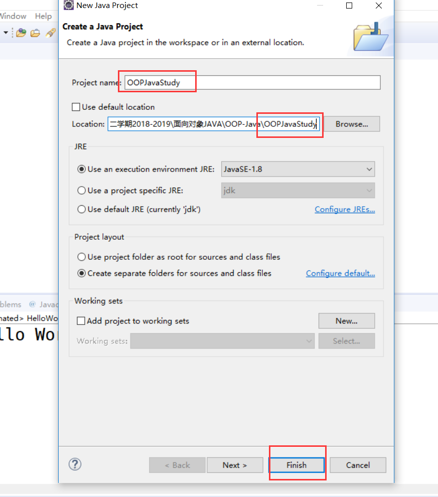
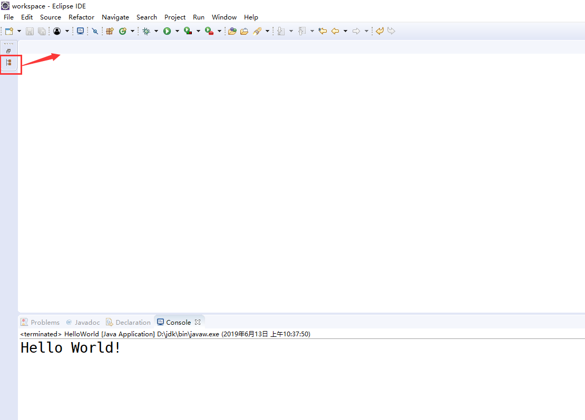
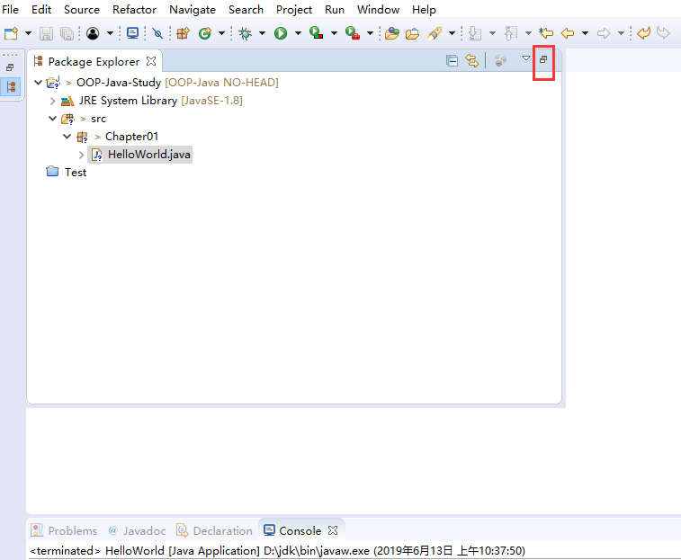
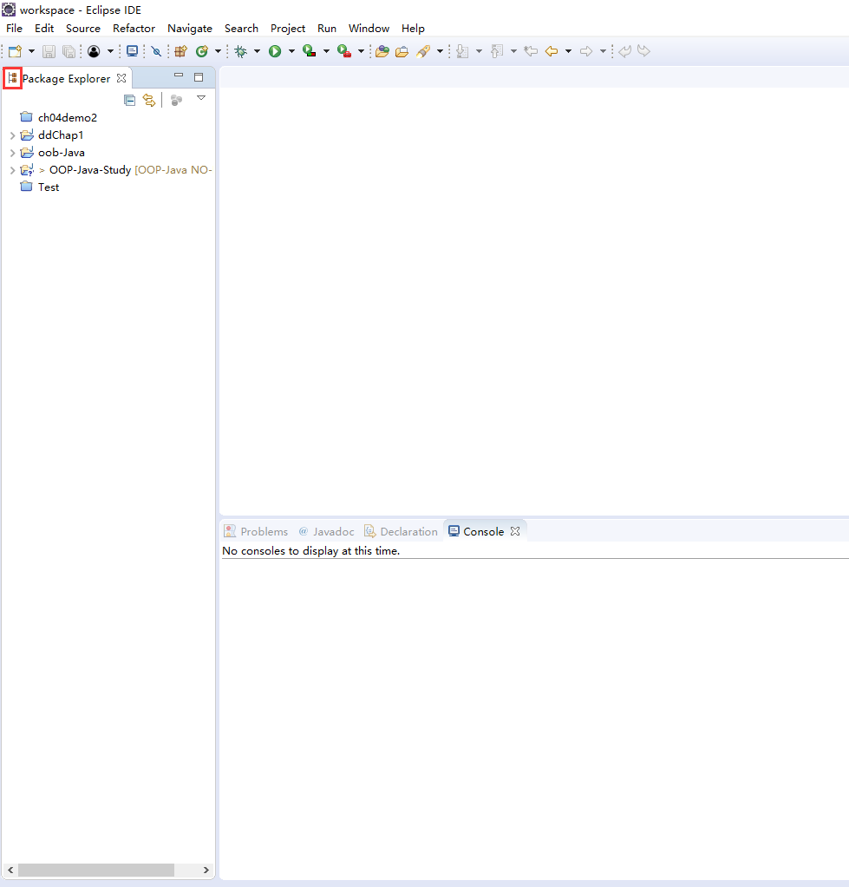
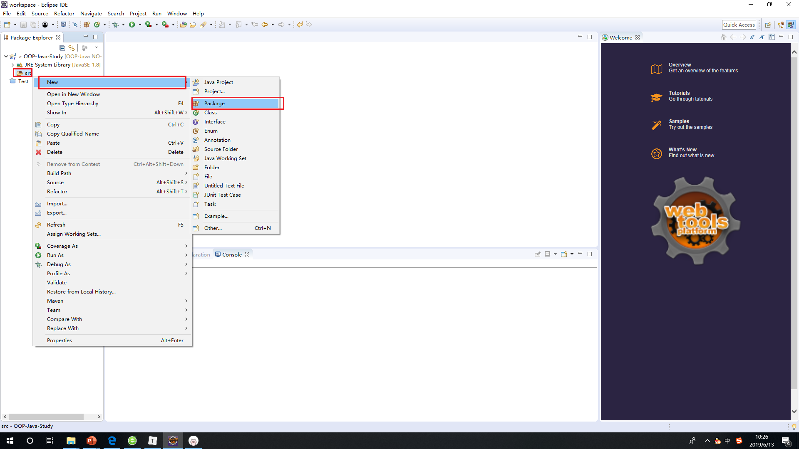
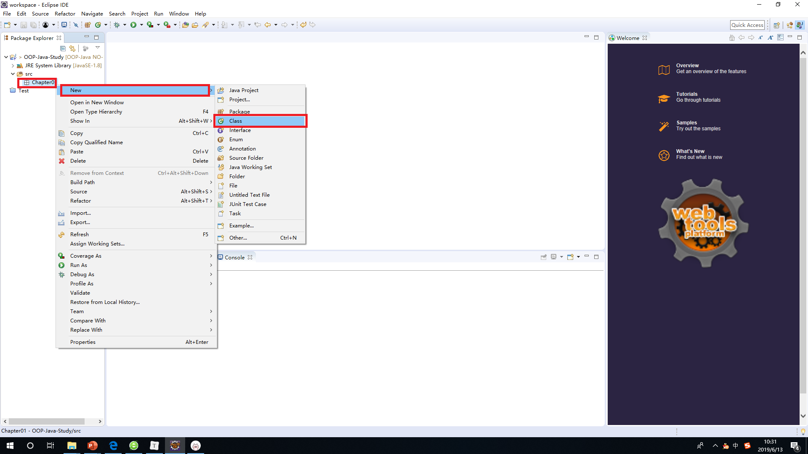
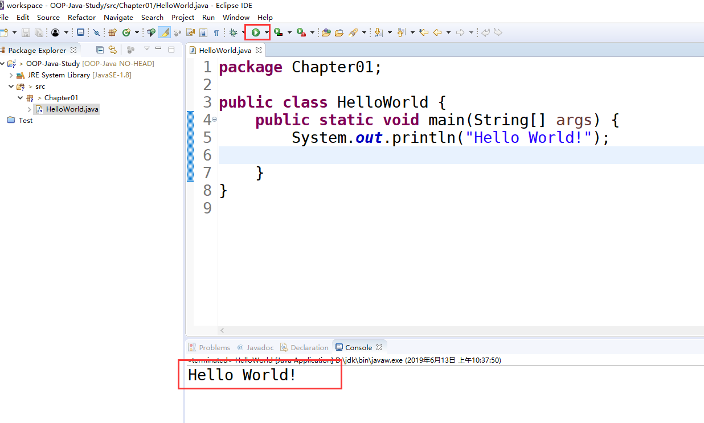
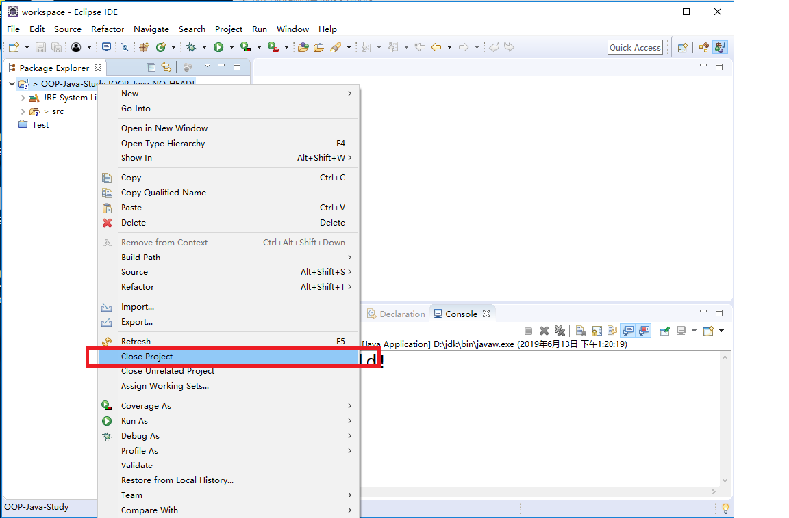
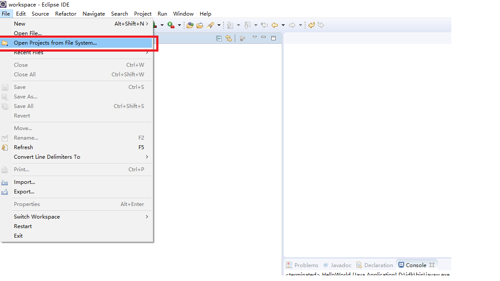
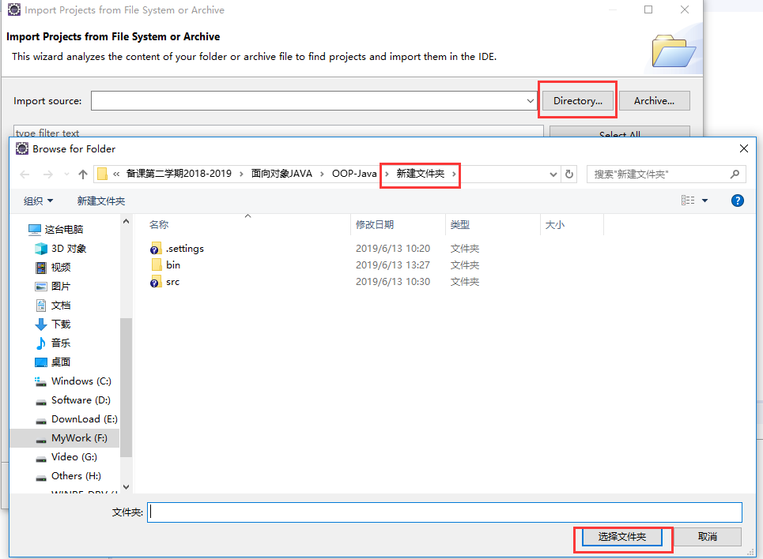

# Elipse的使用  

[TOC]

## 1 软件使用步骤  
### 1.1 打开Elipse  
先在需要的目录下创建一个文件夹，用来存放项目文件：   
  
打开软件，File->New->Java Project  
   
### 1.2 新建Java工程  
新建Java工程，默认文件名和项目名是相同的，如果不同可以重新在目录后面添加文件名即可：  
  
### 1.3 打开Project Explorer  
Window->Show View->Project Explorer   
  
记住左侧的小图标，防止这个框贴边时，你点击该图标即可：  
  
   
   
### 1.4 新建Package  
在src文件下新建一个Package（包）：  
   
给包起一个名字：  
  
此时，在src文件夹下面多了一个文件夹：  
  
**包：实际上到了文件中就是一个文件夹**  

## 2 HelloWorld  

### 2.1 新建class  
在Chapter01下新建一个类HelloWorld：  
   
   
创建之后再HelloWorld.java中自动形成如下代码：  
```Java
package Chapter01;

public class HelloWorld {
	
	}
}
```
### 2.2 创建main函数  
```Java
package Chapter01;

public class HelloWorld {
	public static void main(String[] args) {
		System.out.println("Hello World!");
		
	}
}
```
### 2.3 编译并运行  
点击编译并运行的按钮，可以看到运行的结果：  
   
编译完成后会在，对应的bin文件夹Chapter01文件夹下出现一个，字节码文件：  
  

## 3 下次如何打开   
+ 一般情况下，下次打开还是之前最近的路径;
+ 如果有多个项目的话，为了编译方便，可以关闭其中的一个； 
   
## 4 添加文件  
可以用于添加新项目或者删除了的项目：  
>>>> 选择从文件系统中打开项目：  
  
>>>> 只需要选择文件夹即可加载：  
  
  
>>>> 逐级目录打开即可：  
 

## 5 更换路径  
由于以上创建的目录都存在问题，


